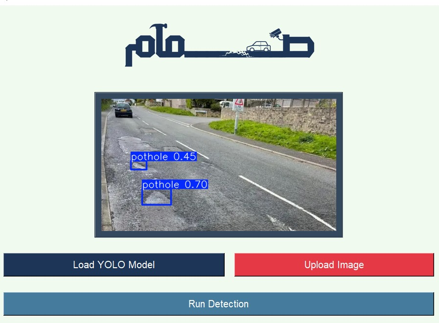

# Pothole Detection System

The **Pothole Detection System** is an AI-powered solution designed to identify and locate potholes in images using the YOLOv8 object detection model. The project aims to assist with road maintenance and infrastructure improvement by automating pothole detection.

## Overview
This system takes an image as input, processes it using a trained YOLOv8 model, and outputs the same image with bounding boxes drawn around detected potholes. The solution also features a user-friendly **Graphical User Interface (GUI)** where users can upload images and visualize the results.

## Objective
- Detect potholes in road images accurately using computer vision techniques.  
- Reduce manual inspection efforts and provide an automated solution for road defect detection.

## Technologies Used
- **YOLOv8**: State-of-the-art object detection model for locating potholes in images.  
- **Python**: Programming language for building the model and application logic.  
- **Tkinter**: Built the GUI for an interactive user experience.  

## How It Works
1. **Data Collection and Preprocessing**:
   - The system uses a dataset of annotated road images with pothole labels.
   - Images are preprocessed for model training.

2. **Model Training**:
   - The YOLOv8 model is trained on annotated images to detect potholes with high accuracy.
   - Data augmentation techniques were applied to improve model generalization.

3. **GUI Implementation**:
   - A GUI built with Tkinter allows users to:
     - Upload an image.
     - View the processed image with detected potholes highlighted by bounding boxes.

4. **Output**:
   - The processed image with pothole bounding boxes is displayed, showing the location of detected potholes.

## Results
The model achieved **high detection accuracy** on the test dataset.  
Example outputs include:

## Achievements
- **4th Place** in the AI Hackathon organized by KPMG, Ministry of Digital Economy, and HTU.  
- Awarded a **5000 JOD prize** to further work and improve the project and implementation.

## Future Improvements
- Enhance the model with a larger, more diverse dataset.  
- Extend functionality to real-time pothole detection in video streams.  
- Integrate GPS coordinates for detected potholes to assist road maintenance teams.
- Implement this project in collaboration with the goverment.
